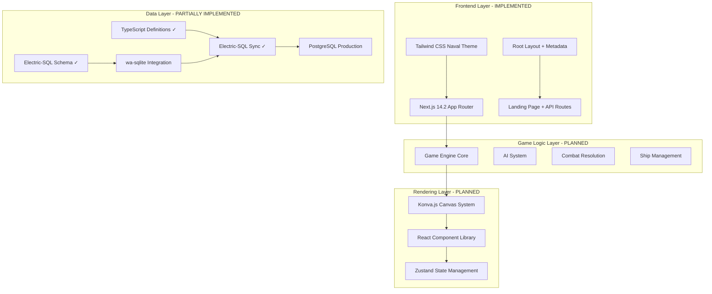
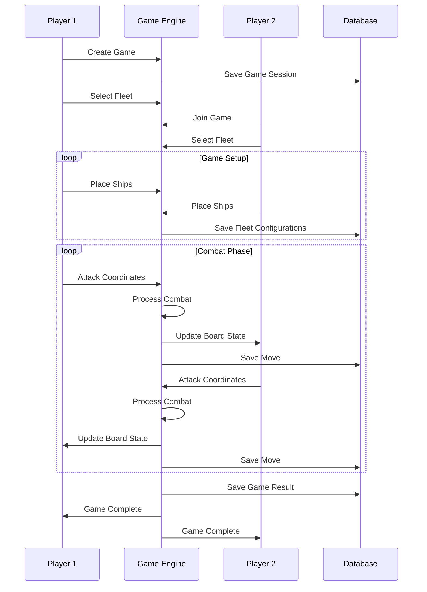
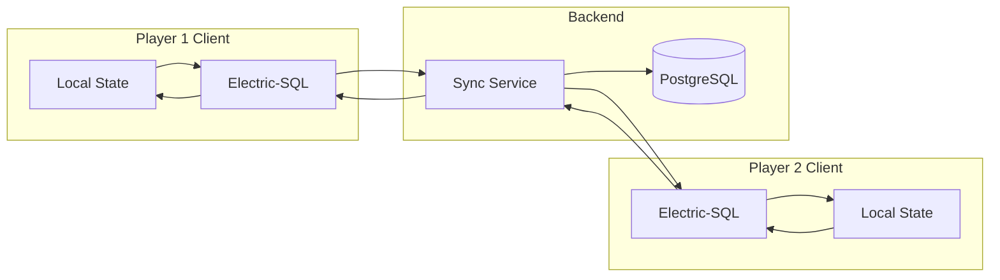

# System Architecture

## High-Level System Architecture



## Implementation Status Overview

### ✅ PHASE 1 COMPLETE (100% - All 7 Tasks)
- **TASK-001**: ✅ Next.js 14 project initialization with TypeScript strict mode
- **TASK-002**: ✅ Core dependencies installation (Konva.js, Electric-SQL, Zustand, etc.)
- **TASK-003**: ✅ Development environment setup with Docker and comprehensive tooling
- **TASK-004**: ✅ Electric-SQL configuration with real-time sync capabilities
- **TASK-005**: ✅ Database schema & seed data with 60+ historical ships
- **TASK-006**: ✅ Tailwind CSS & design system with naval theme (2,027+ lines)
- **TASK-007**: ✅ Basic layout components with accessibility compliance (1,552 lines)

**Foundation Achievements:**
- **Production-Ready Codebase**: 5,131+ lines of high-quality TypeScript code
- **Advanced Infrastructure**: Enterprise-grade development environment
- **Naval Theme Integration**: Complete maritime aesthetic with accessibility compliance
- **Real-time Architecture**: Electric-SQL CRDT with subscription management operational
- **Component Library**: 8 production-ready components (Header, Footer, Sidebar, Modal, etc.)

### 📝 PHASE 2: CORE GAME ENGINE (Next Priority)
- **TASK-008**: 📝 Implement core game data structures (Critical - Next Up)
- **TASK-009**: 📝 Develop ship placement logic with drag-and-drop
- **TASK-010**: 📝 Build combat system with attack processing
- **TASK-011**: 📝 Create ship type definitions (60+ historical ships ready)
- **TASK-012**: 📝 Implement special abilities system
- **TASK-013**: 📝 Build AI player framework
- **TASK-014**: 📝 Develop AI algorithms (4 difficulty levels)

### ⏳ FUTURE PHASES (Phases 3-10)
- **Phase 3**: Konva.js rendering and interactive game board
- **Phase 4**: User management and authentication system
- **Phase 5**: Local gameplay modes (AI and hot-seat multiplayer)
- **Phase 6**: Online multiplayer with real-time synchronization

## Database Schema

### Core Tables

```sql
-- Users and Authentication
CREATE TABLE users (
    id INTEGER PRIMARY KEY,
    username TEXT UNIQUE NOT NULL,
    email TEXT UNIQUE NOT NULL,
    password_hash TEXT NOT NULL,
    created_at DATETIME DEFAULT CURRENT_TIMESTAMP,
    last_login DATETIME
);

-- Game Sessions
CREATE TABLE games (
    id INTEGER PRIMARY KEY,
    game_mode TEXT NOT NULL, -- 'local_ai', 'local_multiplayer', 'online'
    status TEXT NOT NULL, -- 'setup', 'active', 'completed', 'abandoned'
    player1_id INTEGER REFERENCES users(id),
    player2_id INTEGER REFERENCES users(id),
    winner_id INTEGER REFERENCES users(id),
    created_at DATETIME DEFAULT CURRENT_TIMESTAMP,
    completed_at DATETIME
);

-- Fleet Configurations
CREATE TABLE fleets (
    id INTEGER PRIMARY KEY,
    game_id INTEGER REFERENCES games(id),
    player_id INTEGER REFERENCES users(id),
    ship_data JSON NOT NULL, -- Ship positions and types
    created_at DATETIME DEFAULT CURRENT_TIMESTAMP
);

-- Game Moves History
CREATE TABLE moves (
    id INTEGER PRIMARY KEY,
    game_id INTEGER REFERENCES games(id),
    player_id INTEGER REFERENCES users(id),
    move_number INTEGER NOT NULL,
    target_x INTEGER NOT NULL,
    target_y INTEGER NOT NULL,
    result TEXT NOT NULL, -- 'hit', 'miss', 'sunk'
    timestamp DATETIME DEFAULT CURRENT_TIMESTAMP
);

-- User Statistics
CREATE TABLE user_stats (
    user_id INTEGER PRIMARY KEY REFERENCES users(id),
    games_played INTEGER DEFAULT 0,
    games_won INTEGER DEFAULT 0,
    total_shots INTEGER DEFAULT 0,
    total_hits INTEGER DEFAULT 0,
    favorite_ship_type TEXT,
    longest_win_streak INTEGER DEFAULT 0
);
```

## High Level Procedures

### Game Flow Process



### Real-time Multiplayer Sync



## File Architecture Description

### Component Architecture (React/Next.js)

```
src/
├── app/                    # Next.js App Router
│   ├── layout.tsx         # Root layout with metadata
│   ├── page.tsx           # Home page
│   ├── game/              # Game routes
│   └── api/               # API routes
├── components/            # Reusable UI components
│   ├── ui/               # Basic UI primitives
│   ├── game/             # Game-specific components
│   └── layout/           # Layout components
├── lib/                  # Core business logic
│   ├── game/             # Game engine
│   ├── ai/               # AI system
│   ├── database/         # Database operations
│   └── utils/            # Utility functions
├── hooks/                # Custom React hooks
├── stores/               # Zustand state stores
├── types/                # TypeScript type definitions
└── styles/               # Global styles and themes
```

### Functional Programming Patterns
- **Pure Functions**: Game logic functions are pure and testable
- **Immutable State**: Game state updates use immutable patterns
- **Composition**: Small, composable functions for complex operations

### Object-Oriented Patterns
- **Ship Classes**: Inheritance hierarchy for different ship types
- **Strategy Pattern**: AI difficulty levels as strategies
- **Observer Pattern**: Game state changes notify UI components

### Shared Resources
- **Type Definitions**: Centralized in `/types` directory
- **Utility Functions**: Common operations in `/lib/utils`
- **Constants**: Game configuration and ship data
- **Hooks**: Reusable state logic and side effects

### Self-Sustained Components
- **Game Board**: Complete rendering and interaction logic
- **Ship Placement**: Drag-and-drop with validation
- **Combat System**: Independent damage calculation
- **AI Engine**: Self-contained decision making
